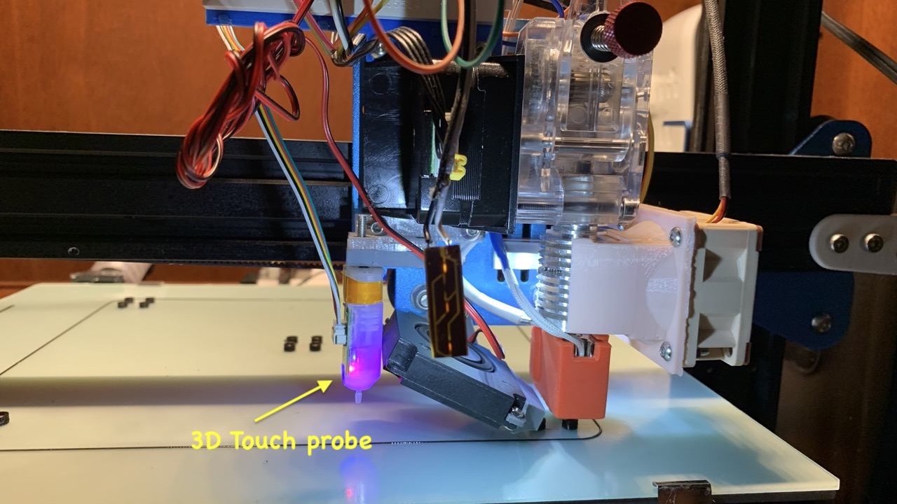
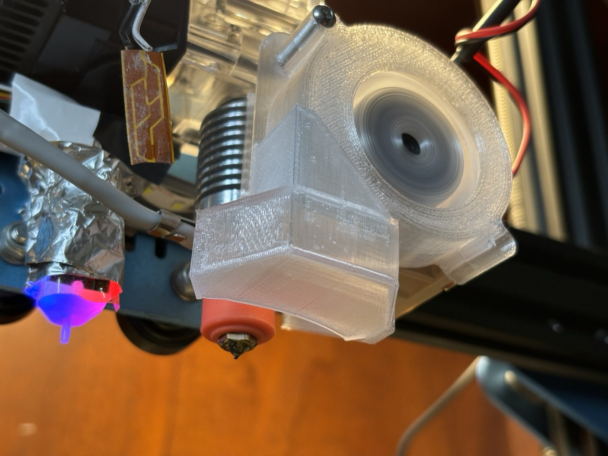
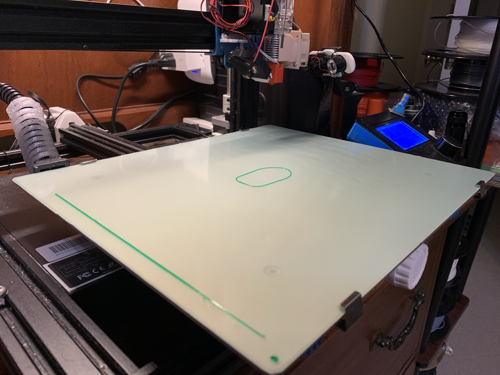
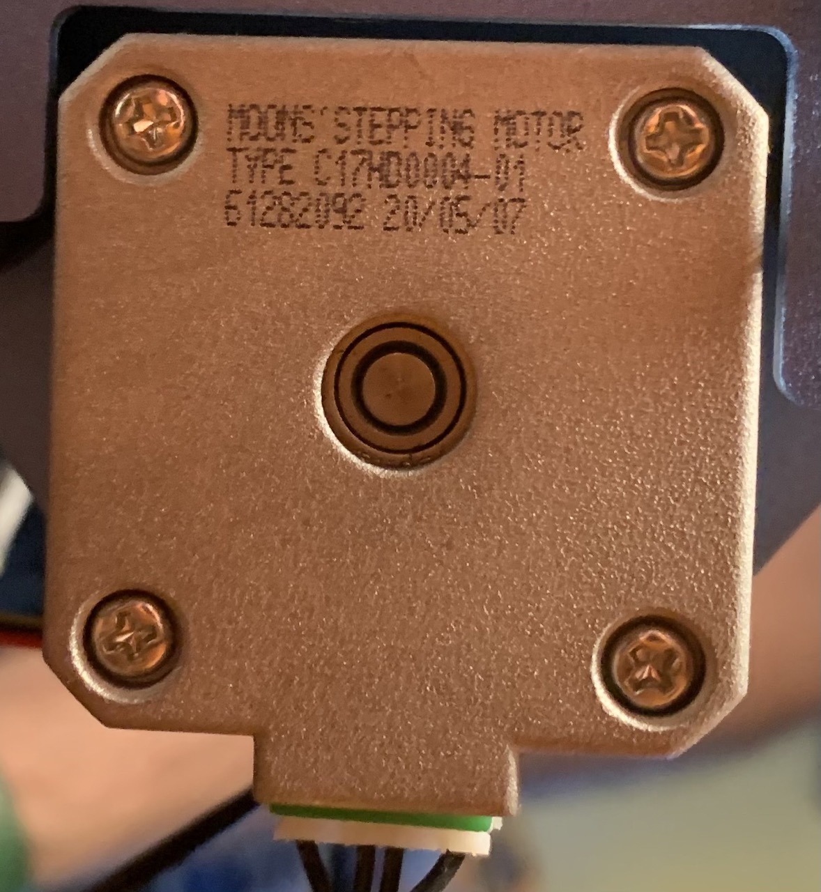
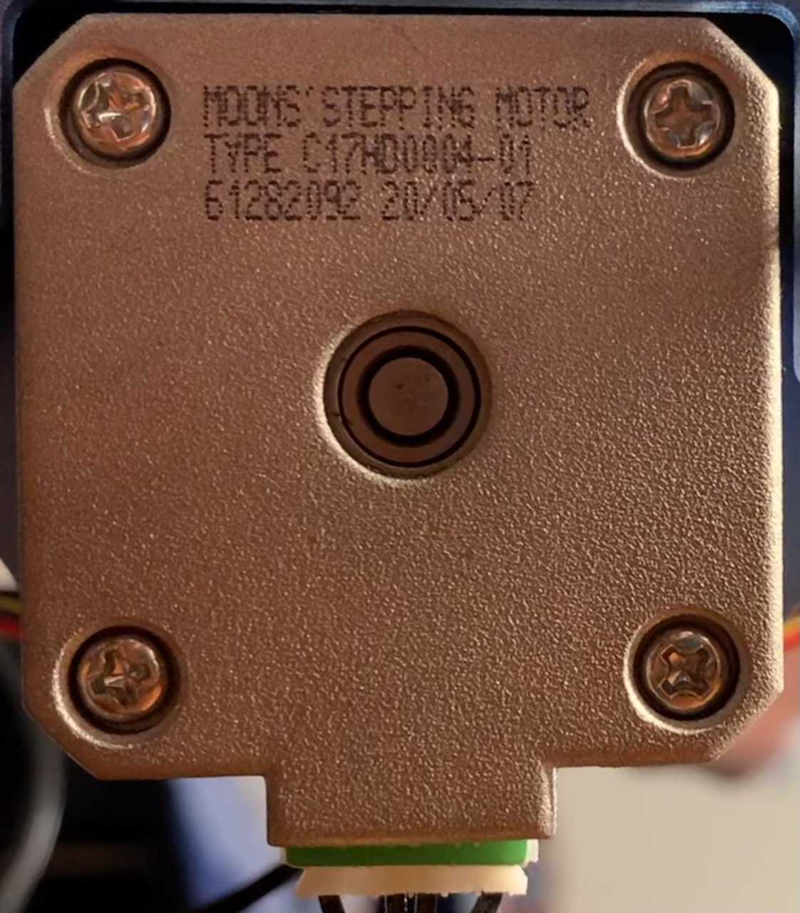
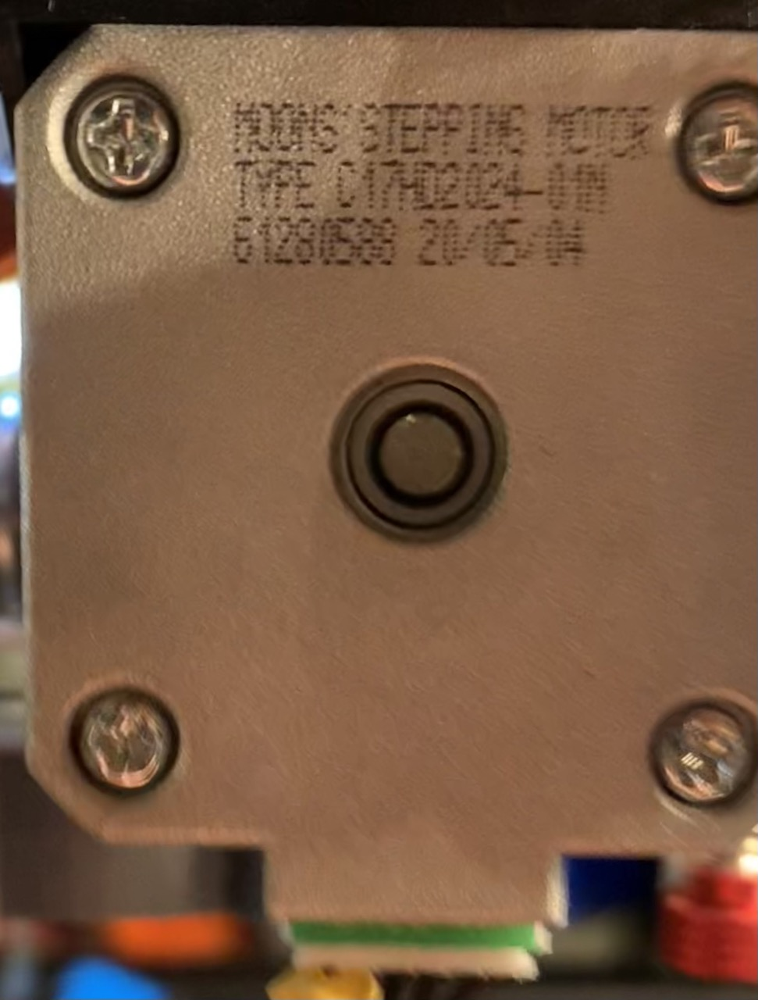
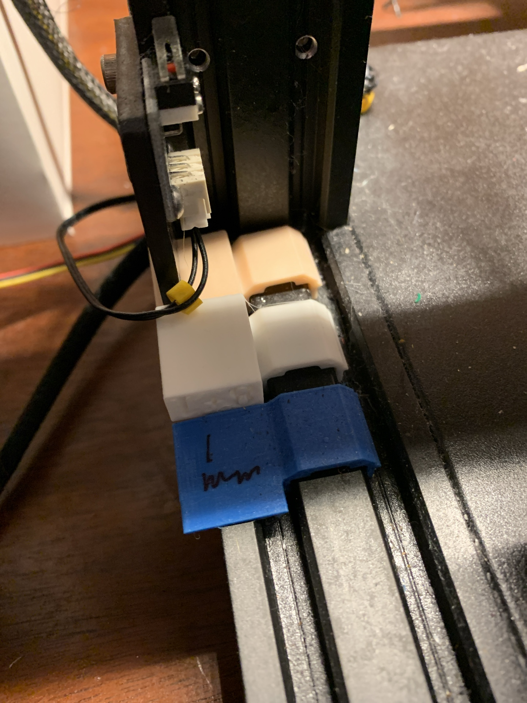

# Sovol SV01 (classic) upgrades, parts, and materials

## Reliability upgrades
| upgrade | img | links |  
| --- | --- | --- | 
| general upgrades |  | [larger image](img/printhead.jpeg) | 
| high flow  upgrade |  | [larger image](img/voclano%20style%20hotend.jpeg) | 
| BMG/left clone   extruder |  | [amazon](<https://a.co/d/bordiUr>) |
| X belt  tensioner |  | [printables](<https://www.printables.com/model/445064-x-and-y-belt-tensioner-mods-sovol-sv01>) |
| X range  extender |  | [printables](<https://www.printables.com/model/167210-nemesis-x10dr-x-axis-range-extender-for-sovol-sv01>) |
| Y belt  tensioner |  | [printables](<https://www.printables.com/model/445064-x-and-y-belt-tensioner-mods-sovol-sv01>) |
| Y stepper  mount |  | [thingi](https://www.thingiverse.com/thing:4838967) |
| Level probe |  | [3D Touch on Amazon](https://a.co/d/0owbKth) |
| runout sensor mount |  | [JSchulze mount](<https://www.thingiverse.com/thing:4702282>) |
|  filament roll mount |  | [ender 3 roll mount](<https://www.thingiverse.com/thing:3209211>) &   [bearing](https://a.co/d/90L8IW4) |
| stepper  cooling  fins |  | [uxcell](https://a.co/d/aYJ3Zk2) on amazon |
| splice  breadboard  mount |  | [printables](<https://files.printables.com/media/prints/158918/stls/1483358_f108b1d6-a148-4276-bba7-06b74ad5d344/breadboard_mount.stl>) |
| silicone  mounts&  Aluminum   wheels |  | [amazon](https://a.co/d/6jfQews) |
| bed clips |  | [amazon](https://a.co/d/7JL6rtf) |
| ferrules  |  | [amazon](https://a.co/d/hUzuvzK) |

## Noise reduction upgrades
| upgrade | img | links |  
| --- | --- | --- | 
| BTT SKR Mini   E3 V3.0   control board |  | [E3 V3.0](https://a.co/d/51EUZl3) |
| quiet power  supply fan  (only 12V  fan works!) |  | [wathai on  amazon](https://a.co/d/24aplno) |
| quiet part  cooling |  | [wathai  4010 blower](<https://a.co/d/6yR5Fmj>) |
| part cooling  mount |  | [swivel for  4010 part  cooling   blower](<https://www.printables.com/model/471880-swivel-for-4010-part-cooling-blower-sv0103-bmgleft>) | 
| quiet case fan   & heatbreak fan |  | [noctua](https://a.co/d/gO9xUxP)   on amazon | 
| buck   converter   for noctua's |  | [amazon](https://a.co/d/ecNWJ9P) |
| 4020 case  fan and buck   converter   mount |  | [mount STL](<https://www.printables.com/model/213163-mount-for-silent-400-mainboard-axial-cooling-fan-f>) |
| heatbreak   fan mount |  | [printables](<https://www.printables.com/model/491989-40x0-fan-mount-for-e3dv6-style-heatbreaks-centered>) |
| alternative   part cooling   for bmg |  | [printables](https://www.printables.com/model/466448-501540x0-parthotend-cooling-for-sv0103-with-bmglef) |
| 5015 blower fan (noisy) |  | [amazon](https://a.co/d/emv9oxA) |
| convert 4010 to quiet 5015 blower |  | [thingiverse](https://www.thingiverse.com/thing:5930214) |
| 4010 axial for conv- ersion |  | [amazon](https://a.co/d/5wkSaSN) |

## Accessories

| accesory | img | links | 
| --- | --- | ---|
| raspberry pi   and case |  | [raspi](https://vilros.com) and [case](<https://www.thingiverse.com/thing:922740>) |
| pi camera   and mount |  | [camera](https://a.co/d/dSdaBow) [IR spotlights](https://a.co/d/jax8Tq6) [ribbon cable](https://a.co/d/bCktKH6) & [mount stl](<https://www.printables.com/model/158940-pi-camera-support-for-20mm-rail-holes-for-dorhea-p>) |
| APC UPS   and Wemo  smart plugs |  | [ be650g](https://a.co/d/j0rVtcV)   and [ wemo](https://a.co/d/0c2rCXv)   on amazon |
| lid for blue  lcd screen |  | [printables](<https://www.printables.com/model/489612-lcd-display-lid-for-sovol-sv01-or-ender-3>) | 
| LED bar  mount |  | [printables](<https://www.printables.com/model/454875-led-bar-support-for-sovol-sv0103-with-bmg-extruder>) |

## Maintenance
| item | img | links | 
| --- | --- | ---|
| noclogger |  | [Noclogger](noclogger.com)  or [generic](https://a.co/d/da5QdSg) |
| nozzle  cleaning  |  | [needles](https://a.co/d/hRjQNYg)   or [rods](https://a.co/d/iFYYc8U)| 

## Spare parts

| part | img | links |
| --- | --- | --- |
| volcano style heatblock |  | [find @ amazon](https://a.co/d/ji4frxp) |
| all metal   heatbreak |  | [yunbotong on amazon](https://a.co/d/fkr1iOX) |
| volcano silicone socks |  | [find @ amazon](https://a.co/d/hDsSlHV) |
| volcano brass nozzles |  | [find @ amazon](https://a.co/d/a8r83gt) |
| 24V 70W hotend heater |  | [find @ amazon](https://a.co/d/gRNovJU) |
| HT-NTC100K thermistor |  | [find @ amazon](https://a.co/d/f613qRR) |
| FR-4/G-10 garolite buildplate |  | [amazon](https://a.co/d/d0B1V7T) | 
| V slot wheels |  | [amazon](https://a.co/d/240LR4G) |
| X Stepper |  | [NEMA17 on  amazon](https://a.co/d/hBkb0kq) |
| Y Stepper |  | [NEMA17 on  amazon](https://a.co/d/hBkb0kq) |
| E Stepper |  | [NEMA17 on  amazon](https://a.co/d/hBkb0kq) |
| spiral cable  wrap |  | [buy on  amazon](https://a.co/d/iAAA734) |
| Connector crimper kit |  | [buy on amazon](https://a.co/d/0pm9C3N) |

## Materials

| material | img | links | 
| --- | --- | --- |
| eSun cleaning  filament,   Sovol dryer   & CC3D PETG |  | [esun clean fil](https://a.co/d/gpyQDKD) [sovol dryer](<https://a.co/d/6h4sCjo>) &  [cc3d petg](<https://www.amazon.com/stores/page/CBE70C6F-154D-45EF-AD40-390049B9A523?ingress=2&visitId=dd56032d-dc01-476f-bef5-5f8d2dee8413&ref_=ast_bln>)   on amazon |
| CC3D silk PLA |  | [amazon](<https://www.amazon.com/stores/page/462C1936-52A4-46DB-9F58-E775EC668252?ingress=2&visitId=dd56032d-dc01-476f-bef5-5f8d2dee8413&ref_=ast_bln>) |
| CA glue+ accellerant,  urethane glue,  elmers purple  glue stick &  hairspray |  | [CA glue/ accelerant](https://www.amazon.com/dp/B07Y6HG8B6),  [more CA](https://a.co/d/2lVBcOi),  [urethane gorilla](https://www.amazon.com/dp/B009M9F6JA),  [elmers](https://a.co/d/bHA1sv2), &  [hairspray](https://www.walmart.com/ip/Garnier-Fructis-Style-Extreme-Control-Hairspray-Extreme-Hold-8-25-fl-oz/648274866) |
| CC3D PLA Max |  | [amazon](<https://www.amazon.com/stores/page/F41EE03F-2754-4B5B-83E4-568F89EC4F21?ingress=2&visitId=dd56032d-dc01-476f-bef5-5f8d2dee8413&ref_=ast_bln>) | 

## Calibrations 
| what | img | link |
| --- | --- | --- |
| calibrated Z steps   & BMG extruder e steps |  | [z calib](<https://www.printables.com/model/158919-z-calibration-tower-5-mm-graduations>) |
| Irv Shapiro  adhesion and  part cooling   check |  | [Irv Shapiro  test](https://www.thingiverse.com/thing:4592719), print  at 50%  scale |
| part cooling  bridging test |  | [printables](https://www.printables.com/model/158911-bridging-mini-test-also-tests-cooling-adhesion) |
| ovhng cooling   test |  | [savage Lau  test spring](<https://www.printables.com/model/383190-overhang-test-spring/comments/799861>)   on printables |
| retraction   calibration |  | [retraction   calibration   site](retractioncalibration.com)|
| Z steps   calibration |  | [z step   calibration](https://www.thingiverse.com/thing:4981370)|

## Parts I no longer use
|part | img | link |
| --- | --- | --- | 
| titan clone extruder |  | [amazon](https://a.co/d/2jmgwQm) | 
| hotend |  | [ender3 hotend](https://a.co/d/9fq4j9g)   (don't use the   heatbreak   fins it comes   with) |
| 955 bearings for titan |  | [955](https://a.co/d/fl4OxHA) | 
| 106 bearings for titan |  | [106](https://a.co/d/3Z5DTtp) |
| tensioner for titan |  | [amazon](https://a.co/d/6LCMo99) |
| capricorn PTFE |  | [amazon](https://a.co/d/dTCSR5J) | 
| 0.6 mm   nozzles |  | [amazon](https://a.co/d/a7jK2DG) |
| hardened   steel   nozzles |  | [amazon](https://www.amazon.com/dp/B089ZY11DD) |
| Z stop  alignment |  | [printables](<https://www.printables.com/model/671573-sovol-sv01-volcano-compatible-z-stop-alignment-for>) |

