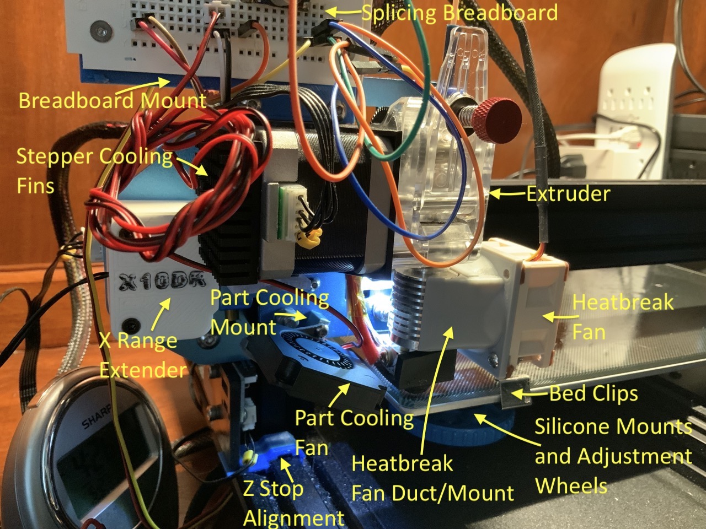
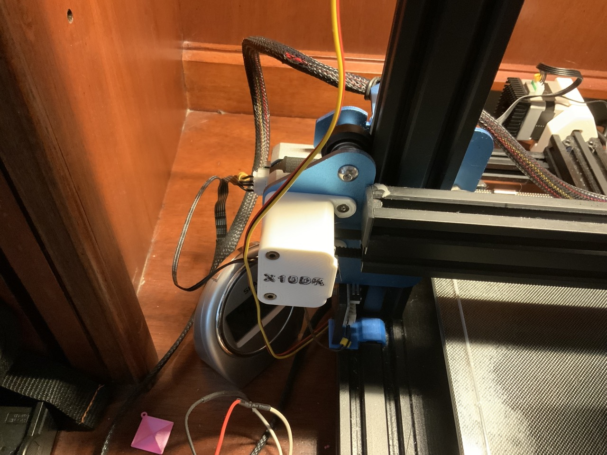
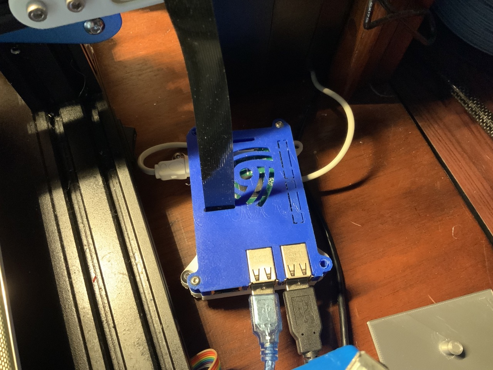
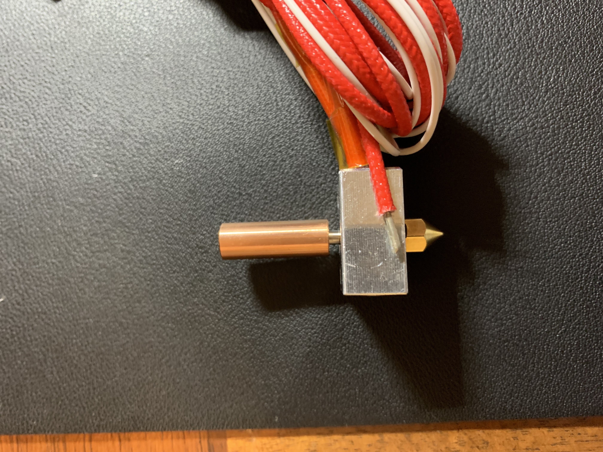

# Sovol SV01 (classic) upgrades, parts, and materials

| upgrade | img | links |  
| --- | --- | --- | 
| general upgrades |  | [larger image](img/printhead.jpeg) | 
| BMG/left clone   extruder |  | [amazon](<https://a.co/d/bordiUr>) |
| quiet part cooling | <video width="320" height="240" controls src="img/Quiet.MOV.small.mp4" type="video/mp4"> | [wathai 4010 blower](<https://a.co/d/6yR5Fmj>) |
| part cooling mount |  | [swivel for 4010 part cooling blower](<https://www.printables.com/model/471880-swivel-for-4010-part-cooling-blower-sv0103-bmgleft>) | 
| quiet case fan   and heatbreak fan |  | [noctua on amazon](https://a.co/d/gO9xUxP) | 
| buck converter for noctua's |  | [amazon](https://a.co/d/ecNWJ9P) |
| 4020 case fan   and buck converter   mount |  | [mount STL](<https://www.printables.com/model/213163-mount-for-silent-400-mainboard-axial-cooling-fan-f>) |
| heatbreak fan mount |  | [printables](<https://www.printables.com/model/491989-40x0-fan-mount-for-e3dv6-style-heatbreaks-centered>) |
| X belt tensioner |  | [printables](<https://www.printables.com/model/445064-x-and-y-belt-tensioner-mods-sovol-sv01>) |
| X range extender |  | [printables](<https://www.printables.com/model/167210-nemesis-x10dr-x-axis-range-extender-for-sovol-sv01>) |
| Y belt tensioner |  | [printables](<https://www.printables.com/model/445064-x-and-y-belt-tensioner-mods-sovol-sv01>) |
| Y stepper mount |  | [thingi](<https://www.thingiverse.com/thing:4838967>) |
| Z stop alignment |  | [printables](<https://www.printables.com/model/216852-sovol-sv01-z-stop-alignment>) |
| stepper cooling fins |  | [uxcell on amazon](https://a.co/d/aYJ3Zk2) |
| BTT SKR Mini   E3 V3.0   control board |  | [E3 V3.0](https://a.co/d/51EUZl3) |
| quiet power supply fan (only 12V fan works!) |  | [wathai on amazon](https://a.co/d/24aplno) |
| splice breadboard mount |  | [printables](<https://files.printables.com/media/prints/158918/stls/1483358_f108b1d6-a148-4276-bba7-06b74ad5d344/breadboard_mount.stl>) |
| bed clips |  | [amazon](https://a.co/d/7JL6rtf)

## Accessories

| accesory | img | links | 
| --- | --- | ---|
| noclogger |  | [noclogger](noclogger.com) |
| raspberry pi   and case |  | [raspi](https://vilros.com) and [case](<https://www.thingiverse.com/thing:922740>) |
| pi camera   and mount |  | [dorrhea camera](https://a.co/d/dSdaBow), [dorrhea IR spotlights](https://a.co/d/jax8Tq6), [camera ribbon](https://a.co/d/bCktKH6), and [mount stl](<https://www.printables.com/model/158940-pi-camera-support-for-20mm-rail-holes-for-dorhea-p>) |
| APC UPS   and Wemo smart plugs |  | [amazon be650g](https://a.co/d/j0rVtcV)   and [amazon wemo](https://a.co/d/0c2rCXv) |
| lid for blue lcd screen |  | [printables](<https://www.printables.com/model/489612-lcd-display-lid-for-sovol-sv01-or-ender-3>) | 
| LED bar mount |  | [printables](<https://www.printables.com/model/454875-led-bar-support-for-sovol-sv0103-with-bmg-extruder>) |

## Spare parts

| part | img | links |
| --- | --- | --- |
| hotend |  | [ender3 hotend amazon](https://a.co/d/9fq4j9g)   (don't use the heatbreak fins it comes with) |
| all metal heatbreak |  | [yubotong on amazon](https://a.co/d/fkr1iOX) |
| 0.6 mm nozzles |  | [amazon](https://a.co/d/a7jK2DG) |
| hardened steel nozzles |  | [amazon](https://www.amazon.com/dp/B089ZY11DD) |
| nozzle cleaning needles |  | [amazon](https://a.co/d/hRjQNYg) | 

## Materials

| material | img | links | 
| --- | --- | --- |
| eSun cleaning filament,   Sovol drier   and CC3D PETG |  | [esun clean fil](https://a.co/d/gpyQDKD), [sovol drier](<https://a.co/d/6h4sCjo>) and [cc3d petg](<https://www.amazon.com/stores/page/CBE70C6F-154D-45EF-AD40-390049B9A523?ingress=2&visitId=dd56032d-dc01-476f-bef5-5f8d2dee8413&ref_=ast_bln>) on amazon |
| CC3D silk PLA |  | [amazon](<https://www.amazon.com/stores/page/462C1936-52A4-46DB-9F58-E775EC668252?ingress=2&visitId=dd56032d-dc01-476f-bef5-5f8d2dee8413&ref_=ast_bln>) |
| CA glue+accellerant, urethane glue, elmers purple glue stick and hairspray |  | [CA glue/accelerant](https://www.amazon.com/dp/B07Y6HG8B6), [more CA](https://a.co/d/2lVBcOi), [urethane gorilla](https://www.amazon.com/dp/B009M9F6JA), [elmers](https://a.co/d/bHA1sv2), and [hairspray](https://www.walmart.com/ip/Garnier-Fructis-Style-Extreme-Control-Hairspray-Extreme-Hold-8-25-fl-oz/648274866) |
| CC3D PLA Max |  | [amazon](<https://www.amazon.com/stores/page/F41EE03F-2754-4B5B-83E4-568F89EC4F21?ingress=2&visitId=dd56032d-dc01-476f-bef5-5f8d2dee8413&ref_=ast_bln>) | 

## Calibrations 
| what | img | link |
| --- | --- | --- |
| calibrated Z steps   & BMG extruder e steps |  | [z calib](<https://www.printables.com/model/158919-z-calibration-tower-5-mm-graduations>) |
| Irv Shapiro adhesion and part cooling check |  | [Irv Shapiro test](https://www.thingiverse.com/thing:4592719) print at 50% scale |
| part cooling bridging test |  | [printables](https://www.printables.com/model/158911-bridging-mini-test-also-tests-cooling-adhesion) |

